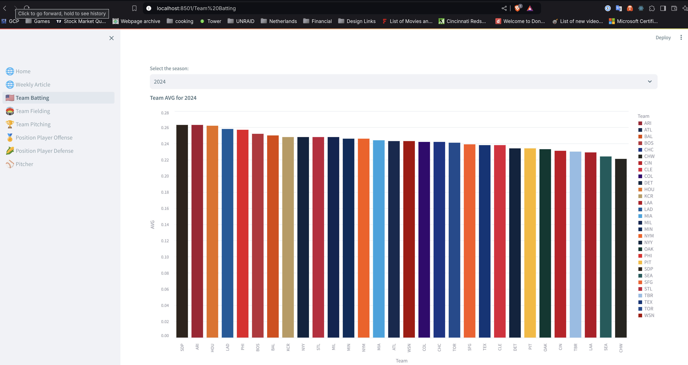
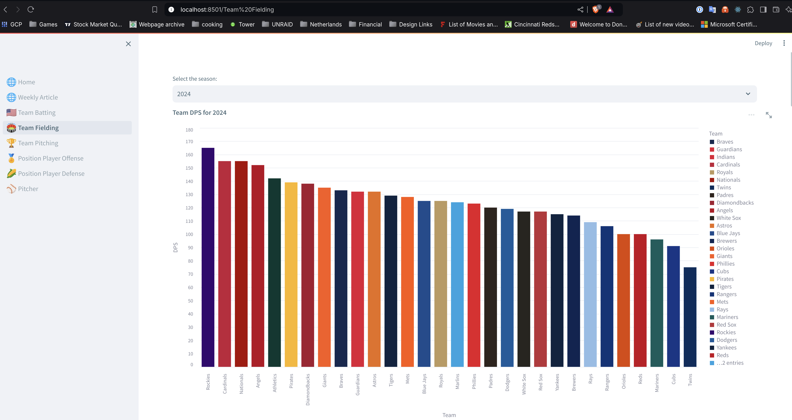
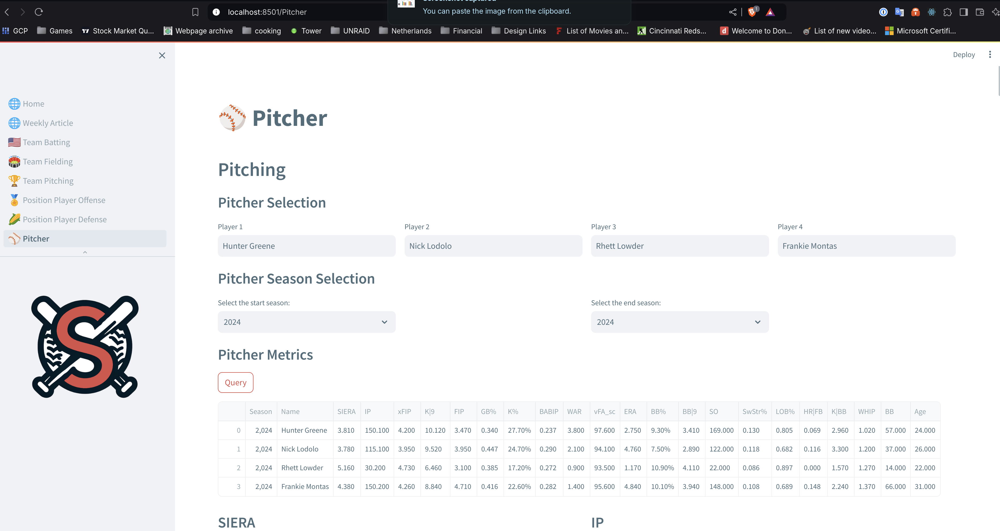
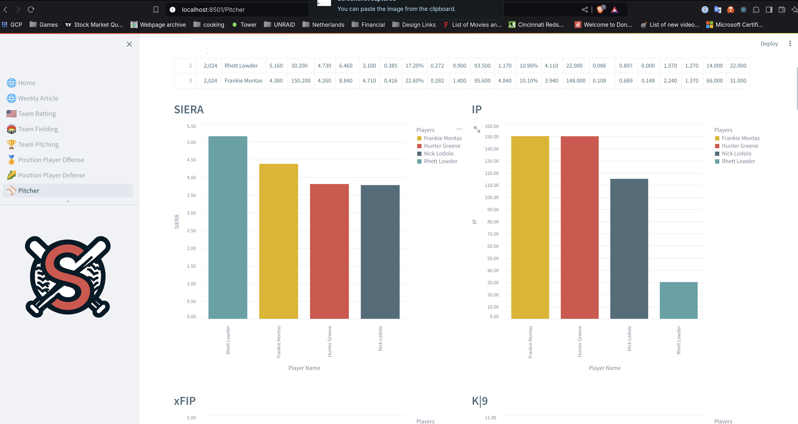
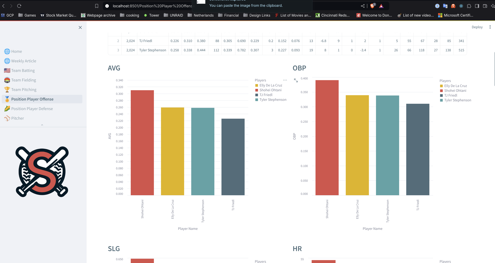
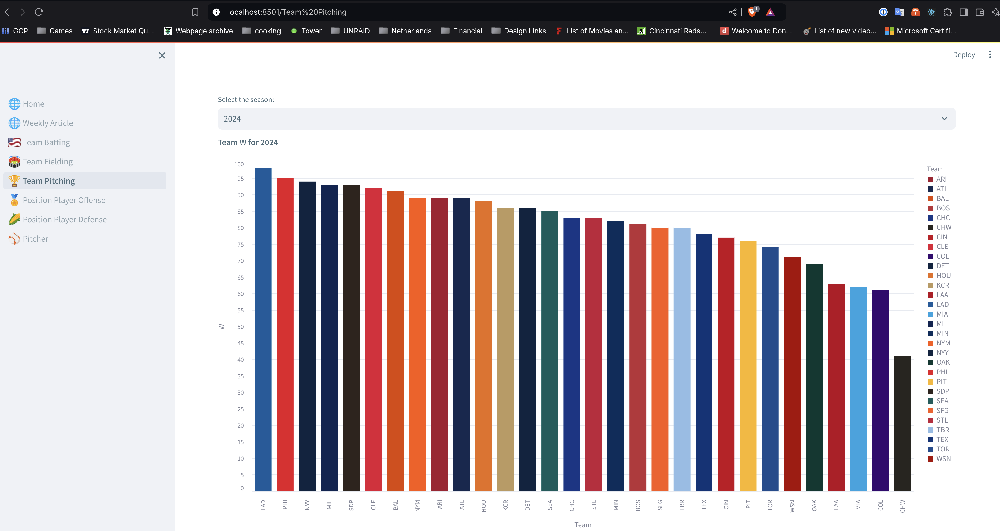

# Baseball Stats Dashboard - Swing And Miss Comparison App

This Streamlit application provides an interactive dashboard for exploring and visualizing various baseball statistics. The dashboard covers team and player performance across different seasons, offering insights into batting, pitching, and fielding metrics.

## Features

- Multi-page application with different views:
  - Home
  - Weekly Article
  - Team Batting
  - Team Fielding
  - Team Pitching
  - Position Player Offense
  - Position Player Defense
  - Pitcher
- Season selection for historical data analysis
- Player selection and comparison
- League average comparisons
- Interactive charts and tables

## Application Screenshots

## Setup

1. Ensure you have Python installed on your system.
2. Install the required dependencies after navigating to the /dashboard directory:

   `pip install -r requirements.txt`

## Project Structure

- `app.py`: Main application file and navigation setup
- `position_player_off.py`: Position player offensive statistics
- `position_player_def.py`: Position player defensive statistics
- `pitcher.py`: Pitcher statistics and metrics
- `docker-compose.yml`: Docker configuration for running the application
- Additional utility files for data processing, player selection, and season selection

## Running the Application

To run the dashboard locally:

1. Navigate to the /dashboard project directory in your terminal.
2. Make sure you have python installed
3. Run the following command: `python -m streamlit run app.py `
4. The application should open in your default web browser.

## Usage

1. Use the sidebar to navigate between different pages of the application.
2. On each page, you can select seasons, players, or teams to analyze.
3. For player comparisons:

- Select a player using the player selection tool
- Choose seasons for comparison
- View the resulting statistics and visualizations

## Customization

You can easily extend the dashboard by adding new pages or modifying existing ones. To add a new page:

1. Create a new Python file for your page (e.g., `new_stats_page.py`)
2. Add the page to the `show_pages` function in `app.py`
3. Implement your new statistics or visualizations in the new file

## Contributing

Contributions to improve the dashboard are welcome. Please feel free to submit pull requests or open issues for any bugs or feature requests.
