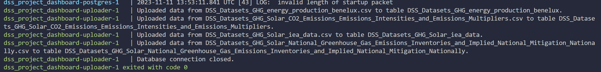

# Data Science and Society Dashboard: Greenhouse Gas Emissions for the Benelux Region and Solar as our Savior

## Overview

The aim with this dashboard is to provide the governments of the Benelux with information on various aspects of energy consumption and solar energy production. The dashboard will encompass an overview of energy consumption across industries, the current state of solar energy generated in the Benelux, and how solar energy can help them with their nationally determined contributions, that each country sets to achieve the Paris Agreement goals.

## Setup

The dashboard is containerized using Docker. Follow these steps to set it up:

### Prerequisites

- Docker installed and running on your machine.

### Installation

1. Clone this repository.
2. run the following command: `docker-compose up --build`
3. Wait for the PostgreSQL database to initialize, and the uploader script to insert data. Look for specific confirmation lines in the terminal (shown below).
   

## Using the Dashboard

- Access the Dashboard at: http://localhost:8501/
- The Dashboard caches queries for improved performance. Switching between panels should not always trigger a re-run of queries. Sometimes you might need to refresh if your screen isn't showing the page icon's.

## If you want to run the prediction model yourself

Due to the sheer size and performance hit of running pytorch + neuralprophet + other large packages, when running alongside our dashboard, we decided it would be best to create a separate docker container where these machine learning packages can be run at your leisure, this prevents the dashboard docker-commpose from taking > 15 minutes to build/run. In addition to the build times, we saw significant dropoff in performance/load times of the dashboard. You can run the predictions docker container with the below instructions:

1. cd into the predictions folder
2. run `docker build -t solar-prediction-app .`
3. once the build is done, run `docker run -v ${PWD}/predictions:/usr/src/app/output solar-prediction-app`
4. The predictions script will run and output a csv
